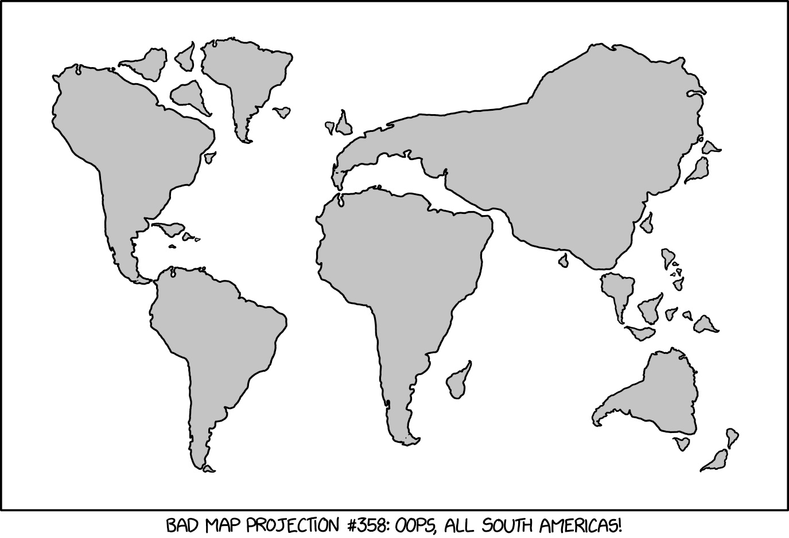
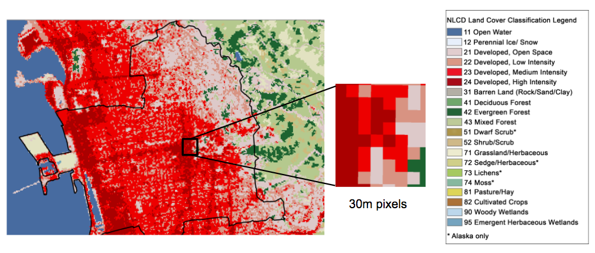
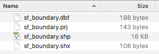
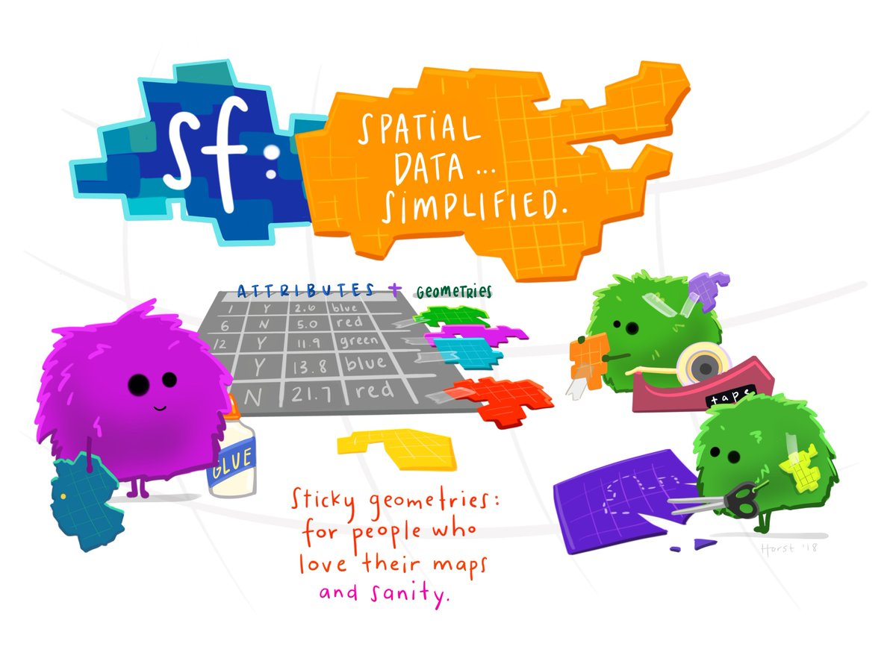

```{r setup, include=FALSE}
knitr::opts_chunk$set(echo = TRUE)
knitr::opts_knit$set(root.dir = normalizePath('../'))
```


## Workshop prep

1. Open the repo at <https://github.com/dlab-berkeley/Geospatial-Fundamentals-in-R-with-sf>
    - Clone the repo or download and unzip the zip file
    - Take note of the folder in which the files are located

2. Start RStudio and open a new script, or **./docs/01-core_concepts_and_plotting.Rmd** 

3. Set your working directory to the folder you unzipped 

4. Install the required libraries in RStudio, if you do not have them already

```{r, eval=F}
install.packages(c("ggplot2", "sf", "tmap", "raster"),
  dependencies=TRUE)
}
```
5. Open the slides, **./docs/01-core_concepts_and_plotting.Rmd**, in your browser (or click the "Part 1 Slides" link the repo).


## About me...


## About you...

Who are you?

Why are you here?

## How to follow along

You have options:

1. Open the slides in your browser (click on the link in the repo, or launch from your local copy of the HTML file).

2. Open the Rmd script (or a blank script) in RStudio.

3. Both of the above.

4. Just chill and watch.

Slides
`./docs/01-core-concepts-and-plotting.html`

RMarkdown Code
`./docs/01-core-concepts-and-plotting.Rmd`

*Make sure you can cut and paste into RStudio*

## Workshop goals

Intro to working with geospatial data in R

- Geospatial data files and formats
- Loading geospatial data in R
- R packages for working with geospatial data
- Coordinate reference systems & map projections
- Mapping geospatial data

</br>

*Key goal is `familiarity`, competency takes lots of practice*


# Geospatial data in R

## Geographic data

are data with  *locations* on or near the surface of the *Earth*.

<center>
</img>
</center>

## Geospatial data

represent location more specifically with **coordinates**

`46.130479, -117.134167`

 <center> 
</img>
</center>

## Coordinate reference systems

Coordinates only make sense when associated with a CRS!

<center>
</img>
</center>

Geographic Coordinates: `Latitude` and `Longitude`

## Coordinate reference systems

Define:

- the shape of the Earth

- the origin (0,0 point)

- the relationship between the system and the real world

- the units

*Because of variations in these, there are **many** geographic CRSs!*

## Projections

A CRS can be *projected*, or can be *unprojected* (a.k.a. *geographic*).

A `map projection` is a mathematial transformation from a curved to a flat surface.

<center>
</img>
</center>

## There are many projections

All introduce distortion, in:

- shape 
- area
- distance 
- direction
- some combination of the above

**The larger the area, the greater the distortion!**


##  Different projected CRSs

There is no one map projection best for all purposes. Selection depends on location, extent and purpose.

<center>
</img>
</center>

## Different projected CRSs

But some projections are definitely worse than others.

<center>
</img>
</center>


## WGS84

For unprojected data, the [World Geodetic System of 1984](https://en.wikipedia.org/wiki/World_Geodetic_System), or 'WGS84', is the most widely used
coordinate reference system.

It is the default CRS for most GIS software.

Almost all longitude and latitude assumed to be **WGS84** unless otherwise specified.

*Historical data much trickier*


# Types of spatial data

## Vector data

The 'connect the dots' model.

Points, lines and Polygons

<center>
</img>
</center>

**We focus on vector data in Parts I and II of this workshop.**

## Raster data

The 'color the squares' model.

A regular grid of cells (or pixels)

<center>
</img>
</center>

**We focus on raster data in Part 3 of this workshop.**

# Software for working with geospatial data

## Software requirements

- ability to import, create, store, edit, visualize and analyze geospatial data

- representation of geometric data objects, *referenced to the surface of the earth via CRSs*
    
- methods to operate on those representations

## GIS

We call software for working with geospatial data **GIS**.

This stands for **Geographic Information System**.

This term is commonly associated with desktop software applications.

## Types of GIS software

Desktop GIS - `ArcGIS`, `QGIS`

Spatial Databases - `PostgreSQL/PostGIS`

Web-based GIS - `ArcGIS Online`, `CARTO`

Software geospatial data support - `Tableau`

Programming languages with geospatial data support 

- `R`, `Python`, `Javascript`


# Why geospatial data?

## Geospatial data are powerful!

You can:

- dynamically determine spatial metrics (e.g. area, length, distance, direction)

- operate on data based on spatial relationships (e.g. intersects, inside, contains)

- link data by location (e.g. linking census data and crime data)

# Why R for geospatial data?

## Why R for geospatial data?

You already use R

Reproducibility 

Free & Open Source

Strong support for geospatial data and analysis

Cutting-edge


# Geospatial data in R

## Prep reminder 

Make sure you have set your working directory to the location of the workshop files.

Make sure you have installed the packages we are going to use.

```{r, eval=F}
#
# Geospatial Data in R Workshop
#

# Make sure needed packages are installed
our_packages<- c("ggplot2", "sf", "tmap", "raster")

for (i in our_packages){
  if ( i %in% rownames(installed.packages()) == FALSE) {
    print(paste(i, "needs to be installed!"))
    install.packages(i)
    
  } else {
    print(paste0(i, " [", packageVersion(i), "] is already installed!"))
    
  } 
}

# Set working directory to folder with workshop files
#setwd("~/Documents/Dlab/workshops/2019/Geospatial-Fundamentals-in-R-with-sf")
```


## Geospatial data in R

There are many approaches to and packages for working with geospatial data in R.

One approach is to keep it simple and store geospatial data in a data frame.

This approach is most common when 

- the data are point data in CSV files and

- you want to map rather than spatially transform or analyze the data 

## About the data

`sf_properties_25ksample.csv`

**San Francisco Open Data Portal**
[https://data.sfgov.org](https://data.sfgov.org)

[SF Property Tax Rolls](https://data.sfgov.org/Housing-and-Buildings/Assessor-Historical-Secured-Property-Tax-Rolls/wv5m-vpq2)

This data set includes the Office of the Assessor-Recorder’s secured property tax roll spanning from 2007 to 2016.

We are using a subset of these data as a proxy for home values.

## Load the CSV file into a data frame

```{r, eval=F}
SFhomes <- read.csv('data/sf_properties_25ksample.csv', 
                    stringsAsFactors = FALSE)

# Take a look at first 5 rows and a few of the columns
SFhomes[1:5,c("YearBuilt","totvalue","AreaSquareFeet","Neighborhood",
              "NumBedrooms")]

```
*Make sure your working directory is set to the folder where you downloaded the workshop files!*


```{r, eval=T}
SFhomes <- read.csv('data/sf_properties_25ksample.csv', 
                    stringsAsFactors = FALSE)

# Take a look at first 5 rows and a few of the columns
SFhomes[1:5,c("YearBuilt","totvalue","AreaSquareFeet","Neighborhood",
              "NumBedrooms")]

```


## Explore the data

```{r, eval=F}
class(SFhomes)            # what is the data object type?
dim(SFhomes)              # how many rows and columns
str(SFhomes)              # display the structure of the object
head(SFhomes)             # take a look at the first 10 records
summary(SFhomes)          # explore the range of values
summary(SFhomes$totvalue) # explore the range of values for one column
hist(SFhomes$totvalue)    # histogram for the totvalue column
```

## Questions to answer

- What columns contain the geographic data?
- Are these data vector or raster data?
- What type of geometry do the data contain? 
    - Points, lines, polygons, grid cells?
- What is the CRS of these data?


## Map it

We can use the R base `plot` function to create a simple map

```{r, eval=FALSE}
plot(SFhomes$lon, SFhomes$lat) # using base plot function
```


## Map it

We can use the R base `plot` function to create a simple map

```{r, eval=F}
plot(SFhomes$lon, SFhomes$lat) # using base plot function
```

```{r, echo=F}
plot(SFhomes$lon, SFhomes$lat, asp=1) # using base plot function
```


## Map it

```{r, eval=F}
plot(SFhomes$lon, SFhomes$lat) # using base plot function
```

```{r, echo=F}
plot(SFhomes$lon, SFhomes$lat, asp=1) # using base plot function
```


## Map overlays

Let's add another geospatial data layer to our map. 

*Map overlay is the fundamental technique of visual geographical analysis.*


## Let's add one more layer

Use the `read.csv` function to read in a file of **Bart Station locations**.

What is the name of the column with the longitude values? latitude?

```{r}
bart <- read.csv("./data/bart.csv")

# take a look
head (bart)
```

## Subset homes for year 2015
For the maps from here on out, to deal with a smaller example dataset, we're going to also subset our data
for only those rows that pertain to year 2015.

```{r}
SFhomes15 <- subset(SFhomes, as.numeric(SalesYear) == 2015)
```


## Add BART stations to map

We can use R's `points` function to add points to the current plot.

```{r, eval=F}
plot(SFhomes$lon, SFhomes$lat)
points(bart$X, bart$Y, col='red')
```


```{r, echo=F}
plot(SFhomes$lon, SFhomes$lat, asp=1)
points(bart$X, bart$Y, col='red')
```

## Let's add one more layer

Now we'll add **SF landmarks**, saved at `data/landmarks.csv`

```{r}
landmarks <- read.csv("./data/landmarks.csv")
head(landmarks)
```

## Add landmarks to our map

Let's create a map of the SF homes, BART Stations and Landmarks all together.

```{r, eval=F}
plot(SFhomes$lon, SFhomes$lat)
points(bart$X, bart$Y, col='red')
points(landmarks$X, landmarks$Y, col='green')
```

```{r, echo=F}
plot(SFhomes$lon, SFhomes$lat, asp=1)
points(bart$X, bart$Y, col='red')
points(landmarks$X, landmarks$Y, col='green')
```


## Map Landmarks

**Where's my third layer? _What happened?..._**
 
```{r, echo=F}
head(bart)
head(landmarks)
```

## CRS issues

Our landmarks CRS seems to be **totally different**!

How do we reconcile its CRS with the CRS of our other data?...


## We need geospatial abilities!

We cannot yet **define** and **transform** CRS.

```{r, echo=F}
par(mfrow=c(1,2))
plot(SFhomes$lon, SFhomes$lat,
     xlab="longitude",
     ylab="latitude",
     main="homes CRS",
     asp=1)
plot(landmarks$X, landmarks$Y, col='green',
     xlab="longitude",
     ylab="latitude",
     main="landmarks CRS",
     asp=1)
par(mfrow=c(1,1))
```

## We need geospatial abilities!

We cannot yet read and plot other non-CSV vector **file formats**
(such as the very common ESRI Shapefile).

<center>
</img>
</center>

## We need geospatial abilities!

We do not yet know how to answer **spatial analysis** questions, like:

        

- *What properties are in the Noe Valley neighborhood?*

- *What is the average property value in each SF neighborhood?*

- *What is the area of each SF Neighborhood, and the property density?*

- *What properties are within walking distance (.25 miles) of the Mission neighborhood?*

## We need geospatial abilities!

For this, we will need other R packages, with **geospatial data structures and functions**.

This will allow us to **turn R into a fully functional GIS**!

_Coming up next..._


## Any questions?

<center>
 </img>
</center>

# Spatial Data Objects in R

## `sf` package

`sf` stands for 'simple features' (a standard developed by the Open
Geospatial Consortium).

The standard allows for storing various geometry types in a hierarchical data model.

A 'feature' is a representation of a thing in the real world (e.g. a building, a city...). 

In other words, each feature consists of both:

- a **geometric representation** of an object

- **some associated information** (building: height, name, etc..., city: population, area, etc...).

## `sf` vs. `sp`

A relatively new package

supersedes the package `sp` and its ecosystem (mainly `rgeos` and `rgdal`).

A one-stop shop for core geospatial data objects and operations.

`sp` still frequently used, but its spatial objects are 'clunkier'.

We'll get brief exposure to sp in Part 3.

## `sf` package

Here are the most common simple features geometries,
which are used to represent vector data in `sf`.

<table border=0>
<tr>
<td>
</img>
</td>
<td>&nbsp;&nbsp;&nbsp;&nbsp;&nbsp;&nbsp;&nbsp;&nbsp;&nbsp;&nbsp;&nbsp;</td>
<td>
- Point
- Linestring
- Polygon
- Multipoint
- MultiLinestring
- MultiPolygon
- Geometry Collection
</td>
</tr>
</table>

 
(From the [Geocomputation in R](https://geocompr.robinlovelace.net/spatial-class.html) textbook, Chapter 2, Figure 2.2)
 
 
## `sf` package

`sf` offers numerous specific benefits, including:

* fast IO (**I**nput and **O**utput)
* enhanced plotting
* integration with R data structures (uses `data.frame`s)
* integration with tidyverse packages and `%>%` piping syntax
* consistent function names (all start with `st_`, for 'spatial type')
* increasing support by other spatial packages (e.g. `tmap`, `ggplot`)
* the simple features data model matches other spatial software (e.g. QGIS, PostGIS, Python's Geopandas)


## `sf` package

First, of course, we'll need to load the package:

```{r}
library(sf)
```

## `sf` objects: IO

We can then read a spatial dataset into an `sf` object using  the `st_read` function.

Let's start with a shapefile of San Francisco census tracts.

*First take a look at the file...*
```{r}
dir("data", pattern = "sftracts.")
```

## `sf` objects: IO

Now let's use the `sf` function `st_read` to load the file in R.
```{r}
tracts = st_read(dsn = './data', layer = 'sftracts')
```

## `sf` objects: structure

Then, as always, we can explore the basic aspects of the object returned,
using base R functions:

```{r}
#the object displays a compact summary, when its name is called
tracts
```


## `sf` objects: structure

What sort of object is this?
```{r, eval=F}
class(tracts)
```

## `sf` objects: structure

```{r}
class(tracts)
```


The object is of both the 'sf' and 'data.frame' classes.

## `sf` objects: structure

It has a number of columns (i.e. attributes, fields), including a geometry column
```{r}
str(tracts)
```

## `sf` objects: structure

We can use basic data.frame functions on it

```{r}
nrow(tracts)
colnames(tracts)
head(tracts, 4)
```

## `sf` objects: basic plotting

We can plot an `sf` object using its plot *method*.

In other words, when we just call R's base `plot` function on an `sf` object,
R will recognize that it's an `sf` object and thus plot it accordingly.

```{r, eval=F}
plot(tracts)
```

## `sf` objects: basic plotting

```{r}
plot(tracts)
```


## `sf` objects: basic plotting

We get an array of plots, one for each variable (up to the first 9).

So then we should be able to plot a single variable by just plotting a subsetted
`sf` dataframe.

```{r, echo=F}
plot(tracts)
```


## Challenge 

Plot just the 'NAME' column's data.

(Note: This will be an example of what we call a 'choropleth' map.)


## Challenge: Solution

```{r}
#read in a shapefile of SF census tracts
plot(tracts['NAME'])
```


## Challenge: Solution

Some of you may have gotten this plot instead:

```{r}
plot(tracts$NAME)```

## Challenge: Solution

What went wrong?

```{r}
class(tracts['NAME'])
class(tracts[, 'NAME'])
class(subset(tracts, select='NAME'))
class(tracts$NAME)
```

## Challenge: Solution

When we use bracket syntax or the subset function,
`sf` objects return new, subsetted `sf` objects.

But when we use the '$' notation, we just get a vector of the column's values!

As always, we need to **be careful and check what kinds of objects we're working with!**

```{r}
head(tracts$NAME)
head(tracts['NAME'])
```


## `sf` objects: geometries

The nice thing about `sf` objects is that they are just `data.frame`s!

The geometry data is just stored in its own special column,
usually named `geom` or `geometry`.

<br>

For the most part, we will not want to manually manipulate the data in the geometry column. 

But when we're just getting started, it can be revealing to tinker a bit.


## `sf` objects: geometries

As we saw earlier, the geometry data is stored in its own column.
Let's take a closer look at that column:

```{r}
tracts$geometry
```


## `sf` objects: geometries

We see that our CRS and some other metadata are connected with the data in this column.

This includes:

* the geometry type and its dimensionality
* the bounding box,
* the CRS arguments
* the CRS' EPSG code (which we'll learn about in a bit)

```{r}
tracts$geometry
```

## `sf` objects: geometries

All the geometries are always in the same CRS.

We can check that CRS using the `st_crs` function:

```{r}
st_crs(tracts)
```


## `sf` objects: geometries

We can also see that this column is some sort of special object.

Unlike with the 'NAME' column, when we subset
the 'geometry' column with '$' we don't just get a vector of values.

This is because we **can't** just get a vector, because the values are
complex objects (geometries), not single values!

So instead, we get a __"list column"__.


## `sf` objects: geometries

So what sort of object is the geometry column?

```{r}
class(tracts$geometry)
class (tracts$geometry[[1]])
```
The column is an `sfc` object ('simple features collection').

It is composed of `sfg` objects ('simple features geometry').

For our purposes, we just need to think of this as **a `list` of geometries**!


## `sf` objects: geometries

We will see each geometry (`sfg`) in our column represented as well-known text (WKT).

Here are some examples: 

`POINT (0 3)`

`LINESTRING (0 3, 1 4, 2 3)`

`POLYGON ((5 2, 1 7, 1 1))`

These are all the dots in the **"connect the dots" model**!


## `sf` objects: summary

**That is the full anatomy of an `sf` object!**

 * `sf` objects are `data.frame` objects with special 'geom' or 'geometry'
columns.
 * The 'geometry' column is a simple features collection (`sfc`) object.
 * Each value in an `sfc` is a simple features geometry (`sfg`) object.

<center>
</img>
</center>

(From the [`sf` docs](https://r-spatial.github.io/sf/articles/sf1.html.))


## `sf` objects: summary

**Here's a more technical summary** (from `sf`'s own [Github Repo](https://github.com/r-spatial/sf)):

<center>
</img>
</center>

## `sf` objects: summary

Now if we look at our census tracts again,
we can see all the pieces we just reviewed:

```{r}
tracts
```


## `sf` objects: plotting

So what about our homes data? Let's plot them with the tracts data!

**NOTE**: With the base `plot` function, we need to use `st_geometry` to pull out just the sf object's geometric features, for plotting.

```{r}
plot(st_geometry(tracts))
points(SFhomes15$lon, SFhomes15$lat)
       
```


## `sf` objects: plotting

What happened? Where are the homes?

Once again, *we cannot plot our data together because the CRS's are not the same!*

```{r}
st_crs(tracts)

st_crs(SFhomes15)
```

## CRS Problems

The #1 reason...

<center>
</img>
</center>

## Reconciling projections

Every spatial object needs a reference to its CRS.

Because the homes are lacking this reference, we'll need to **define** it.

Note the important difference between **defining** and **transforming** projections:

 - **Defining** just makes a spatial object aware of the CRS of its geometries. (This does not change the data's coordinate values.)

 - **Transforming** converts the geometries to a new CRS. (This changes the coordinate values.)


## Reconciling projections

So we need our data all in the same projection.

In order to do this, we're going to need to follow *3 steps*:

1. **Coerce** the homes to an explicitly geospatial object, using `sf`.

2. **Define** (or assign, or set) that object's CRS.

3. **Transform** one of our two objects to the CRS of the other.


## Creating `sf` objects

With `sf`, we can combine steps 1 and 2 in a single step, using the `st_as_sf` function.

<p>&nbsp;</p>

To do this, we need to provide 3 pieces of information to 3 arguments:

__x__: The object to be converted to an `sf` object

__coords__: The columns containing the coordinates.

__crs__: The CRS of the coordinates contained in those columns.


## Coordinate Reference Systems

In order to this, we need to tell R the CRS of our homes data.

**What is our CRS?**

**And how can well tell that to R?**


## CRS definitions

GIS software has database of definitions for thousands of Earth-referenced
CRSs.

Those definitions are are used by GIS, to transform data between CRS's.

We just need to know how to specify our data's CRS in terms that
will allow R to correctly indentify it within that database.


## Referencing the CRS

Our data's CRS is unprojected longitude/latitude on a WGS84 datum.

We can specify it using a common format for referencing CRS's, the `proj4` string:

`st_crs("+proj=longlat +ellps=WGS84 +datum=WGS84")`


## EPSG codes

However, the `proj4` string is long and complicated, and leaves a lot of room for error.

So the **E**uropean **P**etroluem **S**urvey **G**roup devised a simpler system
of numerical codes, called **EPSG** codes.

The longlat, WGS84 EPSG code is 4326.

So we could create our CRS instead using just the EPSG code in a proj4string:

`st_crs("+init=epsg:4326")`

Which, in `sf`, can be simplified even further:

```{r}
st_crs(4326)
```


## `proj4` CRS definitions

Here is some additional info on CRS definitions, for your reference:

[Proj4](http://proj4.org/) is the standard library for defining and transforming map projections and coordinate reference systems.

[Here](https://github.com/OSGeo/proj.4/blob/master/nad/epsg) is an example file of proj4 CRS definitions


## Common EPSG codes

And here are some common codes:

**Geographic CRSs**

* `4326` Geographic, WGS84 (default for lon/lat)

* `4269` Geographic, NAD83 (USA Fed agencies like Census)


**Projected CRSs**

* `5070` USA Contiguous Albers Equal Area Conic

* `3310` CA ALbers Equal Area

* `26910` UTM Zone 10, NAD83 (Northern Cal)

* `3857` Web Mercator (web maps)


## Finding EPSG codes

And here's a resource for looking up EPSG codes and proj4 strings,
should you need to:

[http://spatialreference.org/](http://spatialreference.org/)


## Creating `sf` objects

Now that we know our homes have are in unprojected coordinates with a WGS84 datum
(i.e. EPSG code: 4326), we can call `st_as_sf` as follows:

```{r}
SFhomes15_sf = st_as_sf(SFhomes15, coords = c('lon', 'lat'), crs = 4326)
```

## Check the result

We can check the object type by displaying a summary.
```{r}
SFhomes15_sf
```

## Check it

We can also specifically check the CRS with `st_crs`:

```{r}
st_crs(SFhomes15_sf)
```

Looks good!


## Reprojecting

That takes care of both steps 1 and 2!

Now for step 3.

<p>&nbsp;</p>

We need to take one data set from its current CRS to the other data set's CRS, to reconcile the two.

This is called **transforming**, or **reprojecting**.

## Reprojecting

We want all data in the same CRS. 

Thus, we can either transform `SFhomes15_sf` to the `tracts`'s CRS, or vice versa.

<center>
</img>
</center>

Which one is best???


## Reprojecting

There's no universally right answer.

Usually depends on what operations we plan to run downstream.

For now, we'll **reproject the tracts**.

That way, everything will be in an unprojected CRS, and will plot in decimal degrees (rather than meters, for example).


## Reprojecting

**Note**: If we were working with `sp` objects, we would use the `rgdal` package
to carry out CRS transformations.

However, `sf` encapsulates `rgdal`'s projection-related capabilities.


## Reprojecting

Using `sf`, we can **reproject**, or **transform** an `sf` object
using the `st_transform` function.

The only arguments we need are:

* **x**: The object to be transformed

* **crs**: The target CRS to transform x to (which can be provided as just an integer of the EPSG code)

Syntax...
```{r,eval=F}
new_sf_object = st_transform(original_sf_object, crs=target_crs_epsg_code)
```


## Challenge

Transform the `tracts` object to the same CRS as the `SFhomes15_sf` object.

Name the new object `tracts_lonlat` (to indicate that its CRS is unprojected longitude and latitude).


## Challenge: Solution

We can transform the tracts to the CRS of SFhomes15\_sf using:

```{r}
tracts_lonlat = st_transform(tracts, crs = 4326)
```


## Challenge: Solution

However, note that we could be more explicit!

This approach will make certain that things match up:

```{r}
tracts_lonlat = st_transform(tracts, crs = st_crs(SFhomes15_sf))
```

## Compare the CRSs, again

Are they both defined? Are they the same?

```{r}
st_crs(SFhomes15_sf)
st_crs(tracts_lonlat)
st_crs(SFhomes15_sf) == st_crs(tracts_lonlat)
```


## `sf` objects: plotting

And now we can try again to plot our data together.

(Note: Now that both objects are `sf` objects, we can actually just call the `plot` method 
for each, as long as we pass it the `add=TRUE` argument.)

```{r, eval=F}
plot(st_geometry(tracts_lonlat))
plot(st_geometry(SFhomes15_sf), add=T, col='blue')
```

## `sf` objects: plotting

Success!

```{r, echo=F}
plot(st_geometry(tracts_lonlat))
plot(st_geometry(SFhomes15_sf), add=TRUE, col='blue')
```


## Challenge

Work through the following steps:

1.) Go back to the `landmarks` data that we stranded. Coerce it from a `dataframe` to an `sf` object,
   setting its CRS to EPSG: `3857`, which is the code for Web Mercator.

2.) Read in the 'SFboundary' and 'SFhighways' shapefiles, from the './data' subdirectory.

3.) Reproject either of those layers to the CRS of SFhomes15\_sf, as needed.

4.) Plot tracts, boundary, highways, homes, and landmarks together.
   Make the boundary's border *purple* (check the docs!).
   
5.) Make the highways and the landmarks *red*, and the homes *blue*.


## Challenge: Solution

1.) Go back to the `landmarks` data that we stranded. Coerce it from a `dataframe` to an `sf` object,
   setting its CRS to EPSG: `3857`, which is the code for Web Mercator.

```{r}
landmarks_sf = st_as_sf(landmarks, coords = c('X', 'Y'), crs = 3857)
```

## Challenge: Solution

2.) Read in the 'SFboundary' shapefile, from the './data' subdirectory.

```{r}
SFboundary = st_read('./data', 'SFboundary')
SFhighways = st_read('./data', 'SFhighways')
```

## Challenge: Solution

3.) Reproject either of those layers to the CRS of SFhomes15\_sf, as needed.

**`SFboundary` doesn't need to be transformed.**

```{r}
#check the CRS of SFboundary
st_crs(SFboundary) == st_crs(SFhomes15_sf)
```


## Challenge: Solution

3.) Reproject either of those layers to the CRS of SFhomes15\_sf, as needed.

**`SFhighways` needs to be transformed.**

```{r}
#check th CRS of SFhighways
st_crs(SFhighways) == st_crs(SFhomes15_sf)
#it needs to be transformed
SFhighways_lonlat = st_transform(SFhighways, st_crs(SFhomes15_sf))
```
## Challenge: Solution

3.) Reproject either of those layers to the CRS of SFhomes15\_sf, as needed.

**We know `landmarks` needs to be reprojected, because we just assinged it EPSG 3857.**

```{r}
landmarks_lonlat = st_transform(landmarks_sf, st_crs(SFhomes15_sf))
```


## Challenge: Solution

4.) Plot tracts, boundary, highways, homes, and landmarks together.
   Make the boundary's border *purple* (check the docs!).
   
5.) Make the highways and the landmarks *red*, and the homes *blue*.

```{r, eval=F}
plot(st_geometry(SFboundary), col='white', border='purple')
plot(st_geometry(tracts_lonlat), alpha=0.2, add=T)
plot(st_geometry(SFhighways_lonlat), col='red', add=T)
plot(st_geometry(SFhomes15_sf), col='blue', pch=16, add=T)
plot(st_geometry(landmarks_lonlat), col='green', pch=16, cex=2, add=T)
```

## Challenge: Solution

Excellent! Everything lines up!

```{r, echo=F}
plot(st_geometry(SFboundary), col='white', border='purple')
plot(st_geometry(tracts_lonlat), alpha=0.2, add=T)
plot(st_geometry(SFhighways_lonlat), col='red', add=T)
plot(st_geometry(SFhomes15_sf), col='blue', pch=16, add=T)
plot(st_geometry(landmarks_lonlat), col='green', pch=16, cex=2, add=T)
```


# Advanced mapping

## Plotting packages

*How can we manipulate the aspects of our plots?*

*How can we make our plots prettier?*

*What other options do we have for plotting `sf` objects?*

<p>&nbsp;</p>

We need specific plotting packages!


## What about `ggplot2`?

Most widely used plotting library in R

Not specifically for geospatial data, but can be used to make fabulous maps

Important starting point for the syntax of our go-to mapping package, `tmap`


## `ggplot2`

Load the library

```{r}
library(ggplot2)
```

## Maps with `ggplot2`

Here's how we could plot our homes, colored by their total values:


```{r, eval=F}
ggplot() + geom_point(data=SFhomes15, aes(x=lon, y=lat, col=totvalue))

```


<p>&nbsp;</p>

**Break down the syntax**:

 - `ggplot()`: creates a `ggplot` object
 - ` + geom_point`: adds a point layer to our map
 - `data=SFhomes15_sf`: tells `ggplot2` to draw data from the `SFhomes15_sf` object
 - `aes`: 'aesthetically maps' our variables onto aspects of our plot
 - `x` and `y`: tell `ggplot2` which columns to use for the x- and y-axis positions of the points
 - `col='totvalue'`: tells `ggplot2` to color our points by the values in the 'totvalue' column

## Maps with `ggplot2`

Data-driven symbology!


```{r, eval=T}
ggplot() + geom_point(data=SFhomes15, aes(x=lon, y=lat, col=totvalue))

```


## Maps with `tmap`

Using `ggplot2` gave us more flexbile symbology than using base R's `plot`.

Using `tmap` will give use more cartographic power than using `ggplot2`.

We'll see a quick overview of the package today.

Then we'll get continued practice with `tmap` in Parts 2 and 3.


## `tmap`

As we will see, `tmap` offers some crucial additional options:

- integration with spatial objects (i.e. `sf` and `sp` objects)
- easy interactive maps

## `tmap`

`tmap` stands for thematic map

It's a powerful toolkit for creating maps with `sf` and `sp` objects,
with less code than the alternatives

Syntax inspired by `ggplot2`, but a bit simpler


## `tmap`

First we'l load the library

```{r}
library(tmap)
```

*Note*: You may need to install /load dependencies
- ggplot2, RColorbrewer, classInt, leaflet libraries

```{r, echo=F, message=F}
tmap_mode('plot')
```

## `tmap`: quick tmaps

We can create **q**uick **tm**aps with the `qtm` function:

```{r}
qtm(SFhomes15_sf)
```

## `tmap`: modes

`tmap` has 2 modes:

* **plot**: makes static maps

* **view**: makes interactive maps

Use the command `tmap_mode` to toggle between them:

* `tmap_mode("plot")`

* `tmap_mode("view")`


## `tmap`: modes

We can create an interactive version of the previous map: 

```{r, eval=F}
tmap_mode("view") # set tmap to interactive view mode
qtm(SFhomes15_sf) # Interactive - click on the points
```


## `tmap`: modes

Notice that this is a live, interactive map!  Click to see Popups! Click on the Layer Selector!

```{r, echo=F, message=F}
tmap_mode("view")
qtm(SFhomes15_sf)
```

## `tmap`: modes

Conveniently, we can also toggle between the modes using the `ttm` function.

```{r}
ttm()
ttm()
ttm()
ttm()
ttm()
```

## `tmap`: building custom maps

To customize our tmaps, we need to use `ggplot2`-like  syntax.

Here's how we could recreate the plot we just made in `ggplot2`.

```{r, eval=F}
tm_shape(SFhomes15_sf) + tm_dots(col="totvalue", size = 0.25)
```

<p>&nbsp;</p>

**Break down the syntax**:

 - `tm_shape()`: creates a `tmap` object
 - `SFhomes15_sf`: tells `tmap` to draw data from the `SFhomes15_sf` object
 - ` + tm_dots`: adds a dots layer to our map
 - `col='totvalue'`: tells `tmap` to color our dots by their values in the 'totvalue' column


## `tmap`: building custom maps

```{r, eval=T}
tm_shape(SFhomes15_sf) + tm_dots(col="totvalue", size = 0.25)
```
 
## `tmap`: data driven mapping

Like `ggplot`, we used data values to drive the symbology.

<p>&nbsp;</p>

But **note three important differences**:

1. We didn't use an aesthetic-mapping function like `aes`.
2. We didn't need to specify the x- and y-axis positions.
3. We had to 'quote' our column names!
 
 
## `tmap`: mapping points

The `tm_dots` functions added dots to our map.

`tm_dots` are a type of `tm_symbols()`

See `?tm_symbols` for other types of point symbols.


## `tmap`: mapping polygons

We can also add and customize polygons using `tm_polygons`.

```{r }
tm_shape(tracts) + tm_polygons(col="beige", border.col="red", alpha = 0.4)
```


## `tmap`: mapping lines

And we can add and customize lines using `tm_lines`.

```{r}
tm_shape(SFhighways_lonlat) + tm_lines(col="black")
```


## `tmap`: mapping multiple layers

We can overlay multiple `sf` objects, or layers,
by concatenating the `tmap` geometry-layer commands with plus signs
(again, using `ggplot`-style syntax).

```{r, eval=T}
# Map the SF Boundary first
overlay_map = tm_shape(SFboundary) + 
  tm_polygons(col="beige", border.col="black") +

# Overlay the highway lines next
tm_shape(SFhighways_lonlat) + 
  tm_lines(col="black") +
  
# Then add the house points
tm_shape(SFhomes15_sf) + 
  tm_dots(col="totvalue", size=.25) 

```

## `tmap`: mapping multiple layers

```{r}
overlay_map
```


## `tmap`: mapping multiple layers

What if we then wanted to add our landmarks? 

Does this code work?

```{r, eval=F}
overlay_map +
    tm_shape(landmarks_lonlat) +
    tm_dots(col = 'skyblue', size = 2)
```

## `tmap`: mapping multiple layers

Yup it does!

```{r, echo=F}
overlay_map +
    tm_shape(landmarks_lonlat) +
    tm_dots(col = 'skyblue', size = 2)
```


## `tmap`: CRS management

What if we redid our map using `landmarks_sf` instead of `landmarks_lonlat`?

Does this code work?

```{r, eval=F}
overlay_map +
    tm_shape(landmarks_sf) +
    tm_dots(col = 'skyblue', size = 2)
```

## `tmap`: CRS management

Yup!  What does that tell us about `tmap`?

```{r, echo=F}
overlay_map +
    tm_shape(landmarks_sf) +
    tm_dots(col = 'skyblue', size = 2)
```


## `tmap`: CRS management

`tmap` reprojects on the fly!

 - If the CRSs are defined, `tmap` will use that info. 

 - If not, `tmap` will assume `WGS84`.

 - It will dynamically reproject subsequent layers to match the first one.


## `tmap`: data order

*What's happening here?*  


```{r, eval=F}
SFhomes15_sf_low2high <- SFhomes15_sf[order(SFhomes15_sf$totvalue, decreasing = FALSE),]
SFhomes15_sf_high2low <- SFhomes15_sf[order(SFhomes15_sf$totvalue, decreasing = TRUE),]

high2low = tm_shape(SFhomes15_sf_high2low) + 
  tm_dots(col='totvalue', size=1)
low2high = tm_shape(SFhomes15_sf_low2high) + 
  tm_dots(col='totvalue', size=1)

tmap_arrange(high2low, low2high)
```

## Data Order

The order of the data in the data frame changes the map display.
This is an **important cartographic concern**!

```{r, echo=F}
SFhomes15_sf_low2high <- SFhomes15_sf[order(SFhomes15_sf$totvalue, decreasing = FALSE),]
SFhomes15_sf_high2low <- SFhomes15_sf[order(SFhomes15_sf$totvalue, decreasing = TRUE),]

high2low = tm_shape(SFhomes15_sf_high2low) + 
  tm_dots(col='totvalue', size=1, title='Ordered high to low')
low2high = tm_shape(SFhomes15_sf_low2high) + 
  tm_dots(col='totvalue', size=1, title='Ordered low to high')

tmap_arrange(high2low, low2high)
```


## `tmap`: advanced customization

We can of course tweak all sorts of details in our maps.

```{r, eval=F}
tm_shape(SFboundary) +
  tm_polygons(col="beige", border.col="black") +
  
tm_shape(SFhighways_lonlat) + 
  tm_lines(col="black") +
  
tm_shape(SFhomes15_sf) + 
  tm_dots(col="totvalue", size=.25, 
          title = "San Francisco Property Values (2015)") + 
tm_layout(inner.margins=c(.05, .2, .15, .05)) 
      # bottom, left, top, right
```

## `tmap`: advanced customization

```{r, echo=F}
tm_shape(SFboundary) +
  tm_polygons(col="beige", border.col="black") +
  
tm_shape(SFhighways_lonlat) + 
  tm_lines(col="black") +
  
tm_shape(SFhomes15_sf) + 
  tm_dots(col="totvalue", size=.25, 
          title = "San Francisco Property Values (2015)") + 
tm_layout(inner.margins=c(.05, .2, .15, .05)) 
      # bottom, left, top, right
```

## `tmap`: advanced customization

We can also customize the popups!

Notice the changes relative to the previous code.

```{r, eval=F}
#set mode back to interactive
tmap_mode('view')

tm_shape(SFboundary) + 
  tm_polygons(col="beige", border.col="black") +
  
tm_shape(SFhighways_lonlat) + 
  tm_lines(col="black") +

tm_shape(SFhomes15_sf) + 
  tm_dots(col="totvalue", size=.05, 
          title = "San Francisco Property Values (2015)",
          popup.vars=c("SalesYear","totvalue","NumBedrooms",
                       "NumBathrooms","AreaSquareFeet")) + 
  
tm_layout(inner.margins=c(.05, .2, .15, .05)) # bottom, left, top, right
```

## `tmap`: advanced customization

```{r, echo=F, message=F}
#set mode back to interactive
tmap_mode('view')

tm_shape(SFboundary) + 
  tm_polygons(col="beige", border.col="black") +
  
tm_shape(SFhighways_lonlat) + 
  tm_lines(col="black") +

tm_shape(SFhomes15_sf) + 
  tm_dots(col="totvalue", size=.05, 
          title = "San Francisco Property Values (2015)",
          popup.vars=c("SalesYear","totvalue","NumBedrooms",
                       "NumBathrooms","AreaSquareFeet")) + 
  
tm_layout(inner.margins=c(.05, .2, .15, .05)) # bottom, left, top, right
```


## `tmap`: advanced customization
And we can even access a wide variety of basemaps. 

Here's the list:
<http://leaflet-extras.github.io/leaflet-providers/preview/>

Let's try watercolor!

```{r, eval=FALSE}
tm_basemap("Stamen.Watercolor") +
tm_shape(SFhomes15_sf) + 
tm_dots(col="totvalue", size=.05, title = "San Francisco Property Values (2015)") +
tm_tiles("Stamen.TonerLabels")
```

## `tmap`: advanced customization

Let's try watercolor!

```{r, echo=F, message=F}
tmap_mode('view')
tm_basemap("Stamen.Watercolor") +
tm_shape(SFhomes15_sf) + 
tm_dots(col="totvalue", size=.05, title = "San Francisco Property Values (2015)") +
tm_tiles("Stamen.TonerLabels")
```


## `tmap`: saving and sharing maps

We can use the `tmap_last` function to grab the last map we made.

Here, we save it to a named variable ('map1'), then display it.

```{r}
fav_map <- tmap_last()
```

## `tmap`: saving and sharing maps

Then we can display it.

```{r}
fav_map
```

## `tmap`: saving and sharing maps

And then we can use `tmap_save` to save it.

Let's save in a couple formats, then look at them.

*Note*: We can specify the output format by just using the file extension!

```{r, eval=F}
tmap_save(fav_map, "./output/SF_properties.png", height=6) # Static image file with
tmap_save(fav_map, "./output/SF_properties.html") # interactive web map
```

## `tmap`: saving and sharing maps

There are many ways to publish your maps.

You can share you map online by publishing it to [RPubs](https://rpubs.com).

- You need to have an RPubs account to make that work.

1. Enter the name of your tmap object (`map1`) or your  `tmap` code in the console

2. In the `Viewer` window, click on the **Publish** icon.

<p>&nbsp;</p>

[Here](http://rpubs.com/pfrontiera/358110) is an RPubs Demo.


## `tmap`: going further

`tmap` provides support for so many different types of maps, check out the *tmap: get started* guide, `vignette("tmap-getstarted")`, linked in the documentation.

```{r, eval=F}
#Check out the tmap: get started! guide
?tmap
```

## `tmap`: going further

You also plenty of options for further information:

 - ?tmap

 - ?tmap\_shape

 - ?tmap\_element

 - ?tm\_polygons (tm\_fill, tm\_borders)
 
 - ?tm\_symbols (tm\_dots, etc...)

- The [Geocomputation with R](https://geocompr.robinlovelace.net/) textbook (Lovelace, Nowosad, and Muenchow, 2019).


# Questions


## Final Challenge

Using `tmap` instead of base `plot`, recreate the map from our previous challenge,
but this time **color the homes by their total property values**!.

## Challenge

For reference, here's a summary of the prompt, along with the previous map:

 - Plot tracts, boundary, highways, homes, and landmarks together.
   
 - Make the boundary's border *purple*.
   
 - Make the highways and the landmarks *red*
 
 - Color the homes by their total property values.

```{r, echo=F}
plot(st_geometry(SFboundary), col='white', border='purple')
plot(st_geometry(tracts_lonlat), alpha=0.2, add=T)
plot(st_geometry(SFhighways_lonlat), col='red', add=T)
plot(st_geometry(SFhomes15_sf), col='blue', pch=16, add=T)
plot(st_geometry(landmarks_lonlat), col='green', pch=16, cex=2, add=T)
```


## Challenge: Solution

```{r}
challenge_map_2 = tm_shape(SFboundary) +
    tm_polygons(border.col = 'purple', alpha = 0) +
tm_shape(tracts_lonlat) +
    tm_polygons(col = 'lightgray', border.col = 'darkgray', alpha = 0.3) + 
tm_shape(SFhighways_lonlat) +
    tm_lines(col = 'red') +
tm_shape(SFhomes15_sf) +
    tm_dots(col = 'totvalue', size = 0.25, palette = '-Blues') +
tm_shape(landmarks_sf) +
    tm_dots(col = 'green', size = 0.5) 
```


## Challenge: Solution
```{r, results='hide', message=FALSE}
tmap_mode('plot')
challenge_map_2 + tm_layout(inner.margins=c(.05, .2, .15, .05)) 
```


## Part I Recap

- Foundations of GIS
- Geospatial Data in R
- Basic plots and overlays
- `sf` library: spatial objects and methods in R
- Converting data frames to `sf`
- CRS definitions and transformations
- `tmap`: advanced mapping

## Questions?

That's the end of Part I!

See you in Part II, where we'll cover spatial analysis!

