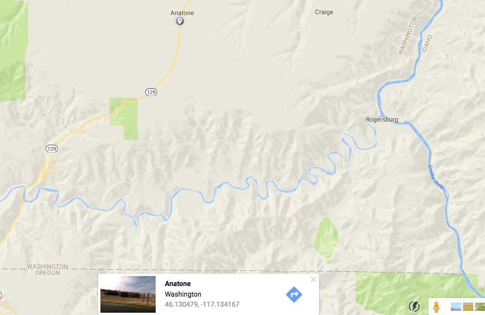
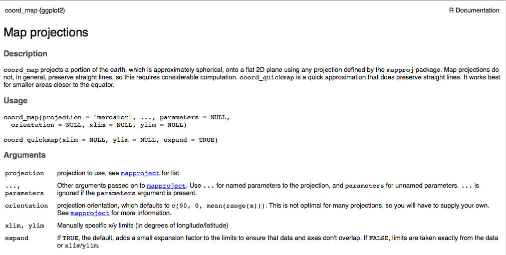
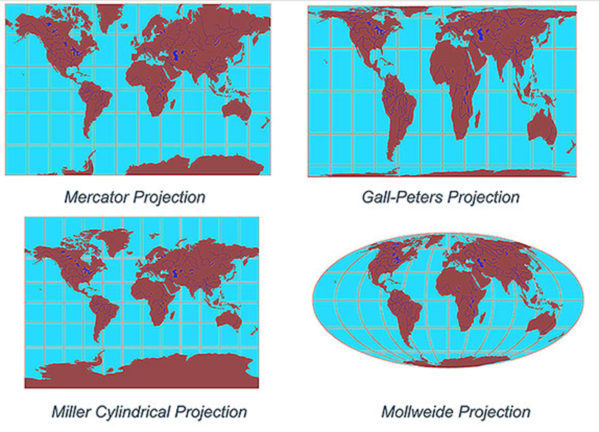

```{r setup, include=FALSE}
knitr::opts_chunk$set(echo = TRUE)
```


--------------------------
# TODO
1. change repo URL at top once we have it
2. decide whether or not to produce and use the tutorial files
3. maybe make some of the challenges a bit more challenging (I think some people find them too simple to be helpful)
4. add explanation of some packages not converting to `sf`, and demo of how to convert objects to `sp` objects, in Day 3
        world_sp = as(world, Class = "Spatial")
        world_sf = st_as_sf(world_sp)
5. name all objects with sf in the name (for San Francisco) SF instead (to disambiguate from sf pkg)


-------------------------

## Workshop Prep

1. Open <https://github.com/dlab-geo/r-geospatial-workshop>
    - Download & unzip the zip file
    - Make a note of the folder in which it is located

2. Start **RStudio** and open a new script file

3. Install required libraries in RStudio - if you do not have them already

```{r, eval=F}
install.packages(
  c("sf","sp","rgdal","tmap","classInt","RColorBrewer",
    "ggplot2","leaflet", "ggmap"), dependencies=TRUE
)
```

# Geospatial Data in R

## Workshop Goals

Intro to working with geospatial data in R

- Geospatial data files and formats
- Loading geospatial data in R
- R packages for working with geospatial data
- Coordinate reference systems & map projections
- Mapping geospatial data

</br>

*Key goal is `familiarity`, competency takes lots of practice*

## About Me


## About you

Who are you?

Why are you here?

## Follow Along

Open one of the tutorial files in a web browser

Slides
`r-geospatial-workshop-pt1.html `

Tutorial
`r-geospatial-workshop-pt1-tutorial.html `

Raw Code
`scripts/r-geospatial-workshop-pt1.R`

*Make sure you can cut and paste into RStudio*
# Geographic Data


## Geographic Data

are data about *locations* on or near the surface of the *Earth*.

</img>


## Geospatial data

represent location more specifically with **coordinates**

`46.130479, -117.134167`
  
</img>


## Coordinate Reference Systems

Coordinates only make sense when associated with a CRS!

</img>

Geographic Coordinates: `Latitude` and `Longitude`

## Coordinate Reference Systems

Define:

- the shape of the Earth

- the origin (0,0 point)

- the relationship between the system and the real world

- the units

*Because of variations in these, there are **many** geographic CRSs!*

## WGS84

The [World Geodetic System of 1984](https://en.wikipedia.org/wiki/World_Geodetic_System) is the most widely used geographic coordinate reference system.

`WGS84` is the default CRS for most GIS software

Almost all longitude and latitude data are assumed to be **WGS84** unless otherwise specified

*Historical data much trickier*

## Geospatial data are powerful!

You can 

- dynamically determine spatial metrics like area, length, distance and direction

- spatial relationships like intersects, inside, contains, etc 

and

- link data by location, like census data and crime data

## Spatial Data

Spatial data is a broader term than geographic data. 

Methods for working with spatial data are valid for geospatial data 

All spatial data are encoded with some type of coordinate reference system

Geospatial data require the CRS to be a model of locations on the Earth

# Types of Spatial Data

## Types of Spatial Data

Vector and Raster Data


## Vector Data

Points, lines and Polygons

</img>

## Raster Data

Regular grid of cells (or pixels)

</img>

*We cover raster data only in Day 3 of this workshop*

# Softare for working with Geospatial Data

## Geospatial data require

software that can import, create, store, edit, visualize and analyze geospatial data

- represented as geometric data objects *referenced to the surface of the earth via CRSs*
    
- with methods to operate on those representations

## GIS

We call software for working with geospatial data **GIS**

**Geographic Information System**

This term is commonly associated with desktop software applications.

## Types of GIS Software

Desktop GIS - `ArcGIS`, `QGIS`

Spatial Databases - `PostgreSQL/PostGIS`

Web-based GIS - `ArcGIS Online`, `CARTO`

Software geospatial data support - `Tableau`

Programming languages with geospatial data support 

- `R`, `Python`, `Javascript`


# Why R for Geospatial Data?

## Why R for Geospatial Data?

You already use R

Reproducibility 

Free & Open Source

Strong support for geospatial data and analysis

Cutting edge


# Geospatial Data in R

## Prep reminder

Make sure you have the packages we are going to use installed and loaded

Make sure you have set your working directory to the location of the workshop files

```{r, eval=F}
install.packages(
  c("sf","sp","rgdal","tmap","classInt","RColorBrewer",
    "ggplot2","leaflet", "ggmap"), dependencies=TRUE
)
```


## Geospatial Data in R

There are many approaches to and packages for working with geospatial data in R.

One approach is to keep it simple and store geospatial data in a data frame.

This approach is most common when 

- the data are point data in CSV files and

- you want to map rather than spatially transform or analyze the data 

## About the Sample Data

`sf_properties_25ksample.csv`

**San Francisco Open Data Portal**
[https://data.sfgov.org](https://data.sfgov.org)

[SF Property Tax Rolls](https://data.sfgov.org/Housing-and-Buildings/Assessor-Historical-Secured-Property-Tax-Rolls/wv5m-vpq2)

This data set includes the Office of the Assessor-Recorder’s secured property tax roll spanning from 2007 to 2016.

We are using a subset of these data as a proxy for home values.

## Load the CSV file into a data frame

```{r, eval=F}
sfhomes <- read.csv('data/sf_properties_25ksample.csv', 
                    stringsAsFactors = FALSE)

# Take a look at first 5 rows and a few of the columns
sfhomes[1:5,c("YearBuilt","totvalue","AreaSquareFeet","Neighborhood",
              "NumBedrooms")]

```
*Make sure your working directory is set to the folder where you downloaded the workshop files!*

##

```{r, eval=T}
sfhomes <- read.csv('data/sf_properties_25ksample.csv', 
                    stringsAsFactors = FALSE)

# Take a look at first 5 rows and a few of the columns
sfhomes[1:5,c("YearBuilt","totvalue","AreaSquareFeet","Neighborhood",
              "NumBedrooms")]

```
## Explore the data

```{r, eval=F}
class(sfhomes)            # what is the data object type?
dim(sfhomes)              # how many rows and columns
str(sfhomes)              # display the structure of the object
head(sfhomes)             # take a look at the first 10 records
summary(sfhomes)          # explore the range of values
summary(sfhomes$totvalue) # explore the range of values for one column
hist(sfhomes$totvalue)    # histogram for the totvalue column
```

## Questions:

- What columns contain the geographic data?
- Are these data vector or raster data?
- What type of geometry do the data contain? 
    - Points, lines, polygons, grid cells?
- What is the CRS of these data?


## Plot of points

Use the R base `plot` function to create a simple map
```{r, eval=FALSE}
plot(sfhomes$lon, sfhomes$lat) # using base plot function
```

## Plot of points

Use the R base `plot` function to create a simple map
```{r}
plot(sfhomes$lon, sfhomes$lat) # using base plot function
```


# `ggplot2`

## `ggplot2`

Most widely used plotting library in R

Not specifically for geospatial data

But can be used to make fabulous maps

Great choice if you already know `ggplot2`


## `ggplot2`

Load the library

```{r}
library(ggplot2)
```

## Maps with `ggplot2`

Basic map with ggplot
```{r, eval=F}
library(ggplot2)

ggplot() + geom_point(data=sfhomes, aes(lon,lat))

```


## Maps with `ggplot2`

Basic map with ggplot
```{r}
ggplot() + geom_point(data=sfhomes, aes(lon,lat), size=1)
```


## Coord_map Option

```{r}
ggplot() + geom_point(data=sfhomes, aes(lon,lat), size=1) + coord_map()
```

## coord_map option

Allows you to associate a map projection with geographic coord data.

</img>

## Map Projections

`Map Projection`: mathematial transformation from curved to flat surface

</img>

A `Projected CRS` applies a **map projection** to a Geographic CRS

## Many Map Projections & Projected CRSs

All introduce distortion, 

- in shape, area, distance, direction, or combo

- the larger the area the greater the distortion

No one map projection best for all purposes

Selection depends on location, extent and purpose

##  Different Projected CRSs

</img>

## `coord_map("mercator")`

`Mercator` is the default map projection used by the `get_coord()` function.

- You don't have to specify it!

It's important to know that you can customize the map projection and parameters if you wish.

But doing this is beyond the scope of this workshop.

## Map points symbolized by `totvalue`

*Data driven symbology*
```{r, eval=F}
ggplot() + geom_point(data=sfhomes, aes(lon,lat, col=totvalue)) + 
  coord_map()
```


## Map points symbolized by `totvalue`

```{r, echo=F}
ggplot() + 
  geom_point(data=sfhomes, aes(lon,lat, col=totvalue), size=1) + 
  coord_map()
```

## Data Order

*What's happening here?*  


```{r, eval=F}
sfhomes_low2high <- sfhomes[order(sfhomes$totvalue, decreasing = FALSE),]

ggplot() + 
  geom_point(data=sfhomes_low2high, aes(lon,lat, col=totvalue)) + 
  coord_map()
```

Try it - Does the output map look different from previous one?


## Data Order

The order of the data in the data frame changes the map display!

```{r, echo=F}
sfhomes_low2high <- sfhomes[order(sfhomes$totvalue, decreasing = FALSE),]

ggplot() + 
  geom_point(data=sfhomes_low2high, aes(lon,lat, col=totvalue)) + 
  coord_map()
```

## Challenge

Map the sfhomes data in decreasing order by `totvalue`.


## Decreasing order by `totvalue`

```{r}
sfhomes_high2low <- sfhomes[order(sfhomes$totvalue, decreasing = T),]
ggplot() + geom_point(data=sfhomes_high2low, aes(lon,lat, col=totvalue)) + 
  coord_map()
```

## More `ggplot` Goodness

What does this code do?
```{r, eval=F}
sfhomes2010_15 <- subset(sfhomes_low2high, as.numeric(SalesYear) > 2009)

ggplot() +
  geom_point(aes(lon, lat, col=totvalue), data = sfhomes2010_15 )  +
  facet_wrap(~ SalesYear)
```

## More `ggplot` Goodness

Visual spatial analysis!
```{r, echo=F}
sfhomes2010_15 <- subset(sfhomes_low2high, as.numeric(SalesYear) > 2009)

ggplot() +
  geom_point(aes(lon, lat, col=totvalue), data = sfhomes2010_15 )  +
  facet_wrap(~ SalesYear)
```


# ggmap

## `ggmap` extends `ggplot`
It allows you to:

- Create _basemaps_ on which you can display your data.

- Use the `Google Geocoding API` to get coordinates for place names and addresses (i.e. to _'geocode'_)

- and more...

## ggmap

Load the libary
```{r}
library(ggmap)
```

## A note on the recent change in `ggmap` authorization

Some `ggmap` functionality may require you to register a Google API key

Beginning July 2018 Google requires a credit card on file to access online APIs

The setup of an API key is beyond the scope of this workshop. So, we we'll only call Google APIs as a demo in this tutorial. This way, at least you can still see what's available to you.


## A note on `ggmap` installation and usage

If you happen to already have a configured Google Maps API key (with Geocoding, Geolocation, and Static Maps APIs all enabled), then you are welcome to try this on your machine by running:

  `register_google(<YOUR_API_KEY_HERE>)`

(If you have problems with `ggmap` you may need to reinstall the library from github.

- See this [StackOverflow discussion](https://stackoverflow.com/questions/34402979/increase-the-api-limit-in-ggmaps-geocode-function-in-r))

Otherwise, just watch for the next few steps!


```{r, eval=F}
#devtools::install_github("dkahle/ggmap")
library(ggmap)
```

##  get_map
Let's check out the `get_map` function. This will allow us to fetch map tiles to display in our maps.

`get_map` uses a number of online mapping services including `Google`, `Stamen` and `OpenStreetMap (OSM)`

`get_map` requires as input a location, expressed as point coordinates.

See `?get_map` for details


## get_map

Let's fetch a simple map on which we can display our points

Here we are centering the map on San Francisco & using the stamen `toner-lite` basemap.


```{r, eval=FALSE}
#Load my API key from file
#(NOTE: THIS WON'T RUN ON OTHERS' MACHINES!)
filename = '/home/drew/Desktop/gmapi.txt'
register_google(gsub('\n', '', readChar(filename, file.info(filename)$size)))
```


```{r, warning=FALSE}
sf_center_point <- c(lon=-122.445144, lat=37.769335 )

sf_map <- get_map(sf_center_point)  
```

## Use `ggmap` to display the map

```{r}
ggmap(sf_map)
```


## `ggmap` with point overlay

Syntax similar to `ggplot`

But `ggmap` takes the name of the map object returned by `get_map()`

```{r, eval=F}
# ggplot() +

ggmap(sf_map) + 
  geom_point(data=sfhomes, aes(x=lon, y=lat, col=totvalue))

```

## `ggmap` with point overlay

```{r}
ggmap(sf_map) +
  geom_point(data=sfhomes, aes(x=lon, y=lat, col=totvalue))
```

## Setting the map Extent

That map is fine but the zoom level isn't right.

We want to zoom in on the data by setting the map extent.

## Customize `get_map` Extent

We can set the map extent by centering the map on our data and increasing the zoom level.

- Note: `get_map` prints a lot of messages to the screen!

```{r, results='hide'}

# Get the center point of the data
sf_ctr <- c(lon = mean(sfhomes$lon), lat = mean(sfhomes$lat))
sf_ctr  # take a look
 
# create the map - setting the zoom level to 12
sf_basemap <- get_map(sf_ctr, source="stamen", maptype="toner-lite", zoom=12)
```


## Customize `get_map` Extent

Now, view the data on top of the `sf_basemap` with `ggmap`

```{r}
ggmap(sf_basemap) +
   geom_point(data=sfhomes, aes(x=lon, y=lat, col=totvalue))
```


## Map Overlays

Finally, let's add another geospatial data layer to our `ggmap`. 

You can use this method to add as many layers as you want to a `ggmap` or `ggplot`.

## Bart Stations and Landmarks

Use the `read.csv` function to read in a file of Bart Station locations. What is the name of the column with the longitude values? latitude?

```{r}
bart <- read.csv("./data/bart.csv")

# take a look
head (bart)
```

## Subset for year 2015
For the maps from here on out, to deal with a smaller example dataset, we're going to also subset our data
for only those rows that pertain to year 2015.

```{r}
sfhomes15 <- subset(sfhomes, as.numeric(SalesYear) == 2015)
```


## Add BART stations to map
```{r, results="hide"}
sfmap_with_bart <- ggmap(sf_basemap) +
  geom_point(data=sfhomes15, aes(x=lon, y=lat))  +
  geom_point(data=bart, aes(x=X,y=Y), col="red", size=3) 
```

## Add BART stations to map
 
```{r }
sfmap_with_bart
```

# Questions?

That's all we'll do with `ggmap` maps for now, since you're probably not able to run the code yourself on your own computer. 

But we'll get a quick glimpse of ggmap's geocoding functionality toward the end of today's material.


## Let's add one more layer

*SF Landmarks*

`data/landmarks.csv`

## SF Landmarks

```{r}
landmarks <- read.csv("./data/landmarks.csv")
head(landmarks)
```

## Map Landmarks

Let's create a map of the SF homes, BART Stations and Landmarks all together.

```{r, results = "hide"}
sfmap_bart_landmarks <- ggplot() +
  geom_point(data=sfhomes15, aes(x=lon, y=lat))  +
  geom_point(data=bart, aes(x=X,y=Y), col="red", size=3) +
  geom_point(data=landmarks, aes(x=X,y=Y), shape=22, 
             col="black", fill="grey", size=4)
```

## Map Landmarks

*All good - are all layers displayed?*  If not, why not?
 
```{r, echo=F}
sfmap_bart_landmarks
```

# GGMap and GGPlot are great!


## BUT!

There are limits to what you can do with geospatial data stored in a data frame.


## Can't transform Coordinate Data

The Landmark data do not have geographic coordinates - longitude and latitude.

You can't map these with `ggmap`.

```{r, echo=F}
head(landmarks)
```

## Can't read & plot geospatial data files

The ESRI Shapefile is the most common file format for geospatial data.

</img>

`ggplot` and `ggmap` cannot **directly** read in or plot shapefile data.

- *though you can do it with a round-about set of commands* :(

## Can't Perform Spatial Analysis

 `ggplot` & `ggmap` can't answer questions like

- *What properties are in the Noe Valley neighborhood?*

- *What is the average property value in each SF neighborhood?*

- *What is the area of each SF Neighborhood and the property density?*

- *What properties are within walking distance (.25 miles) of the Mission neighborhood?*

 You need `spatial data objects` and `spatial methods` for that!

# Spatial Data Objects in R


# `sf` package

## Aside: `sf` vs. `sp`

The `sf` package is the most commonly used to construct and manipulate spatial data objects in R. 

`sf` supersedes the package `sp` and its ecosystem of related packages (mainly 
`rgeos` and `rgdal`). As such, it is a one-stop shop for core geospatial data objects
and operations that used to be spread across those 3 packages.

(`sp` is still frequently used, but its spatial objects are a bit less streamlined.
It will be necessary for our raster work on Day 3, so we'll see a bit of it then.)


## `sf` package

`sf` stands for 'simple features', which is a standard (developed by the Open
Geospatial Consortium) for storing various geometry types in a hierarchical data model.

A 'feature' is just a representation of a thing in the real world (e.g. a building, a city...). In other words, each feature consists of both a geometric representation of an object and some other information about it (building: height, name, etc..., city: population, area, etc...).

Here are the most common simple features geometries,
which are used represent vector data in `sf`.

</img>

(From the  textbook.)


## `sf` package

`sf` offers numerous specific benefits, including:
- fast IO (**I**nput and **O**utput)
- enhanced plotting
- excellent integration with common R data structures (using `data.frame`s)
- integration with the tidyverse packages and its `%>%` piping syntax
- consistent function names (all starting with `st_`)
- its objects are supported by an increasing number of other geospatial packages (e.g. `tmap`, which we'll see later today)
- alignment with other software that uses the simple features data model (e.g. QGIS, PostGIS), or an analogous one (e.g. Python's Geopandas)


## `sf` package

First, of course, we'll need to load the package:

```{r, eval=F}
library(sf)
```

## `sf` objects: IO

We can then read in a spatial dataset into an `sf` object using  the `st_read` function.

Here we're reading in a shapefile of SF census tracts:

```{r}
tracts = st_read(dsn = './data', layer = 'sftracts')
```

## `sf` objects: structure

Then, as always, we can explore the basic aspects of the object returned,
using base R functions:

```{r}
#the object displays a compact summary, when its name is called
tracts
#the object is of both the 'sf' and 'data.frame' classes
class(tracts)
#it has a number of columns (i.e. attributes, fields), including a geometry column
str(tracts)
#we can use basic data.frame functions on it
nrow(tracts)
ncol(tracts)
colnames(tracts)
head(tracts)
```

## `sf` objects: basic plotting

We can plot an `sf` object using its plot method.

In other words, when we just call R's base `plot` function on an `sf` object,
R will recognize that it's an `sf` object and thus plot it accordingly.

```{r}
#read in a shapefile of SF census tracts
plot(tracts)
```

## `sf` objects: basic plotting

Note that we get an array of plots, one for each variable
(or 'field', or 'attribute') in our dataset.

So then we should be able to plot a single variable by just subsetting
the `sf` dataframe for that variable, then plotting the subsetted dataframe.

## Challenge 

Plot just the 'NAME' column's data.

(Note: This will be an example of what we call a 'choropleth' map.)


## Challenge: Solution

```{r}
#read in a shapefile of SF census tracts
plot(tracts['NAME'])
```


## Challenge: Solution

Some of you may have gotten this plot instead:

```{r}
plot(tracts$NAME)
```

What's wrong here?

## Challenge: Solution

```{r}
class(tracts['NAME'])
class(tracts[, 'NAME'])
class(subset(tracts, select='NAME'))
class(tracts$NAME)
```

When we use bracket syntax or the subset function,
`sf` objects return new, subsetted sf objects.

But when we use the '$' notation, we just get a vector of the column's values!

As always, we need to **be careful and check what kinds of objects we're working with!**


## `sf` objects: geometries

The nice thing about `sf` objects is that they are just `data.frame`s!

The geometry data is just stored in its own special column,
usually named `geom` or `geometry`.

For the most part, we will not want to manually manipulate the data in the geometry column.

However, when we're just getting started, it can be enlightening to introspect its contents...


## `sf` objects: geometries

As we saw earlier, the geometry data is stored in its own column.
Let's take a closer look at that column:

```{r}
tracts$geometry
```
## `sf` objects: geometries

One thing we can see is that our CRS and some other metadata is stored as part of this column.
This includes:
- the geometry type and its dimensionality
- the bounding box,
- the CRS arguments
- the CRS' EPSG code (which we'll learn about in a bit)

## `sf` objects: geometries

Of course, all the geometries in the column must have the same CRS.

We can check the CRS of an `sf` object using the `st_crs` function:

```{r}
st_crs(tracts)
```


## `sf` objects: geometries

And we can get our bounding box using `st_bbox`,
or subset certain values:

```{r}
bbox = st_bbox(tracts)
bbox
bbox$xmin
```

## `sf` objects: geometries

We can also see that this column is some sort of special object.
We can see this because, unlike with the 'NAME' column above, when we subset
the 'geometry' column with '$' we don't just get a vector of values.

Of course, we _couldn't_ just get a vector of values, because the values are
geometries, which are way too complex to be collapsed into a vector!


## `sf` objects: geometries

So, what sort of object is this?

```{r}
class(tracts$geometry)
```
An `sfc` object! This is short for 'simple features collection', which is
basically just an R `list` of geometries (because as we just said,
a vector wouldn't work).

## `sf` objects: geometries

So then, what sort of object is each individual geometry?

(Note the **double-bracket** notation, which indexes values out of a `list`.
Single brackets would just return us a new, subsetted list---in this case, a new,
subsetted `sfc` object.)

```{r}
class(tracts$geometry[[1]])
```
It's an object of the `XY`, `MULTIPOLYGON`, and `sfg` classes!

- `sfg` is short for 'simple features geometry'; this is the geometry data itself!

- `XY` just indicates the dimensionality of that geometry (for all our purposes this will
  be `XY`, but some less commonly used data models include a `Z` dimension)

- `MULTIPOLYGON` just indicates the type of that geometry (which, as we saw earlier, could also be `POINT`, `LINESTRING`, ...)


## `sf` objects: geometries

A simple features geometry is typically either stored as well-known text (WKT) or well-known binary (WKB).

The latter is more easily machine-readable. But the former is human-readable, and is what we see in an `sf` geometry column.


## `sf` objects: geometries

The WKT is just a very simple written representation of the 'connect-the-dots' vector data model.

Here's a point: `POINT (2 4)`

Here's a multipoint: `MULTIPOINT (2 2, 3 3, 3 2)`

Here's a linestring: `LINESTRING (0 3, 1 4, 2 3)`

And here's a polygon: `POLYGON ((1 0, 3 4, 5 1, 1 0))`

(Notice that the polygon's first and last coordinate-pairs are the same!)

## `sf` objects: geometries

Typically, you won't need to create your own geometries from scratch
because you'll just be reading them in from geospatial data files.

But `sf` does provide functions for doing so.

Here are the geometries from our previous slide:

```{r}
pnt = st_point(c(2, 4))
mpnt = st_multipoint(rbind(c(2, 2), c(3, 3), c(3, 2)))
line = st_linestring(rbind(c(0, 3), c(1, 4), c(2, 3)))
poly = st_polygon(list(rbind(c(1, 0), c(3, 4), c(5, 1), c(1, 0))))
plot(poly, col = 'yellow')
plot(line, col = 'blue', lwd = 3, add = T)
plot(mpnt, col = 'red', add = T)
plot(pnt, col = 'black', add = T)
```

##`sf` objects: geometries

For comparison, we can take a look at one of the `sfg` objects in our census tracts:

```{r}
geom = tracts$geometry[[1]]
str(geom)
geom[[1]]
```
Again, note that the first and last coordinate-pairs are the same,
because this is a polygon!


## `sf` objects: geometries

So this should clarify the geometry column:
It is a simple features collection (`sfc`), where each item is just a simple
features geometry (`sfg`).
Each `sfg` holds a WKT representation of the geometry (`sfg`),
and pertains to a row, which typically contains other data describing the row.

## `sf` objects: summary

And that brings us full circle!

We can now see how we could combine a plain old dataframe with a geometry column for it,
and in that way construct an `sf` object from scratch:

```{r}
df = data.frame(list('name' = c('someplace'), 'pop' = c(2)))
new_sf = st_sf(df, geometry = st_sfc(poly))
new_sf
plot(new_sf)
```

## `sf` objects: summary

To recap:
 - `sf` objects are `data.frame` objects with special 'geom' or 'geometry'
columns..
 - The geometry column is a simple features collection (`sfc`) object.
 - Each value in an `sfc` is a simple features geometry (`sfg`) object.

</img>

(From the ![`sf` docs] (https://r-spatial.github.io/sf/articles/sf1.html.))


## `sf` objects: summary

Here's our census tracts data again.
Hopefully you can now see how all those pieces cleanly fit together.

```{r}
tracts
```

## `sf` objects: plotting

So what about our homes data? Let's plot them with the tracts data!

To do that, we'll need to use ggplot (because the homes data is not an sf object).
The `geom_sf` function will allow us to add data from an `sf` object to a ggplot.

```{r}
ggplot() + geom_sf(data = tracts) +
geom_point(data = sfhomes15, aes(lon, lat, col = totvalue))
         
```


## `sf` objects: plotting

What happened?

Our data wound up at totally opposite ends of our map!

Why?


## `sf` objects: plotting

What's the CRS of our census tracts?...
```{r}
st_crs(tracts)
```

And what's the CRS of the SF homes data?...
```{r}
head(sfhomes15, n = 1)
```

**We can't plot our data if it's not in the same CRS!**


## CRS Problems

The #1 reason...

</img>


## Reconciling projections

Every spatial object needs a reference to its CRS.

If it is lacking this reference, we'll need to **define** it.

Note the **important difference** between *defining* and *transforming* projections!

**Defining** just makes a spatial object aware of the CRS of its geometries. (This does not change the data's coordinate values.)

**Transforming** converts the geometries to a new CRS. (This changes the coordinate values.)


## Reconciling projections

So we need our data all in the same projection.
In order to do this, we're going to need to do 3 things:

1. Make our homes an explicitly geospatial object, using `sf`.

2. **Define** (or assign, or set) that object's CRS.

3. **Transform** (or reproject) one of our two objects to the CRS of the other.


## Creating `sf` objects

First, we need to coerce our homes data to an `sf` object.

We saw a crude example of constructing an `sf` object, above.

But we can actually do this in a single line of code, using the `st_as_sf` function!


## Creating `sf` objects

To do this, we need to provide 3 pieces of information to 3 arguments:

__x__: The object to be converted to an `sf` object

__coords__: The columns containing the coordinates.

__crs__: The CRS of the coordinates contained in those columns.


## Coordinate Reference Systems

In order to this, we need to know the CRS of our homes data.

So, what is it?...


## CRS Definitions and Transformations

The coordinate reference system (CRS) defines the mathematical model
of the planet within which the locations of spatial data objects are expressed.

A CRS can be unprojected (if coordinates are expressed as positions on a spheroidal surface),
or projected (if they're expressed on a plane resulting from projecting that surface).

GIS software will have a database of definitions for thousands of Earth-referenced
CRSs and methods for using those definitions to define or transform a CRS.


## Referencing the WGS84 CRS

Our homes data are just decimal degrees on a spheroid. In other words, they are
unprojected longitude & latitude ('longlat').

The most common datum and ellipsoid for that sort of CRS are 'WGS84'.

So we can express our CRS in a `proj4` string as follows:

`CRS("+proj=longlat +ellps=WGS84 +datum=WGS84")`

`proj4` strings are a standard format.


## EPSG codes

However, the `proj4` string format is long and complicated.
And there are *lots* of CRSs out there!

So the **E**uropean **P**etroluem **S**urvey **G**roup devised a simpler system
of numerical codes, called **EPSG** codes.

The longlat, WGS84 EPSG code is:

`CRS("+init=epsg:4326")`


## Proj4 CRS Definitions

Some additional info on CRS definitions:

[Proj4](http://proj4.org/) is the standard library for defining and transforming map projections and coordinate reference systems.

[Here](https://github.com/OSGeo/proj.4/blob/master/nad/epsg) is an example file of proj4 CRS definitions


## Creating `sf` objects

Now that we know our homes have are in unprojected coordinates with a WGS84 datum
(i.e. EPSG code: 4326), we can call `st_as_sf` as follows:

```{r}
sfhomes15_sf = st_as_sf(sfhomes15, coords = c('lon', 'lat'), crs = 4326)
```

## Check it

Once we set the CRS we can check it with `st_crs`:

```{r}
st_crs(sfhomes15_sf)
```

Looks good!


## Reprojecting

That takes care of both steps 1 (create `sf` object) and 2 (define CRS)!

Now that our homes are an `sf` object with the correct CRS, we'll need to reproject
either `sfhomes15_sp` or `tracts`, so that they are in the same projection.

Which one should we project, and why?...


## Reprojecting

There's no universally right answer to that question.
Usually the answer will depend on what operations you plan to run downstream.

In our case, we'll reproject our tracts,
so that everything is in an unprojected CRS and plots with units of decimal degrees.


## Reprojecting

We can **reproject**, or **transform** an `sf` object
using the `st_transform` function.

The only arguments we need are:

**x**: The object to be transformed

**crs**: The CRS to transform x to (which can be provided as just an integer of the EPSG code)

## Challenge

Transform the tracts object to the same CRS as the sfhomes15\_sf object.
Name the new object 'tracts\_lonlat' (to indicate that its CRS is unprojected
longitude and latitude).


## Challenge: Solution

We can transform the tracts to the CRS of sfhomes15\_sf using:

```{r}
tracts_lonlat = st_transform(tracts, crs = 4326)
```


## Challenge: Solution

However, note that if we want to be super explicit, to be certain things match up,
we can index the EPSG code directly out of sfhomes15\_sf's CRS object, as follows:

```{r}
tracts_lonlat = st_transform(tracts, crs = st_crs(sfhomes15_sf)$epsg)
```

## Compare the CRSs, again

Are they both defined? Are they the same?

```{r}
st_crs(sfhomes15_sf)
st_crs(tracts_lonlat)
st_crs(sfhomes15_sf) == st_crs(tracts_lonlat)
```


## `sf` objects: plotting

And now we can try again to plot our data together.

(Note that we can ues the `aes` function to do aesthetic mapping
in an `geom_sf` call, just as we could with `geom_point` and other ggplot functions.)

```{r}
ggplot() + geom_sf(data = tracts_lonlat) + 
           geom_sf(data = sfhomes15_sf, aes(col = totvalue))
```

Nice!


## Challenge

Work through the following steps:

1. Coerce the landmarks dataframe to an `sf` object,
   with EPSG: `3857`, Web Mercator as its CRS.

2. Read in the 'sfboundary' shapefile, from the './data' subdirectory.

3. Reproject whichever of those two layers to the CRS of sfhomes15\_sf, as needed.

4. Plot tracts, boundary, homes, and landmarks together, in that order.
   Make the border purple, the homes green, and the landmarks orange.


## Challenge: Solution

1. Coerce the landmarks dataframe to an `sf` object,
   with EPSG: `3857`, Web Mercator as its CRS.

```{r}
landmarks_sf = st_as_sf(landmarks, coords = c('X', 'Y'), crs = 3857)
```

## Challenge: Solution

2. Read in the 'sfboundary' shapefile, from the './data' subdirectory.

```{r}
sfboundary = st_read('./data', 'sfboundary')
```

## Challenge: Solution

3. Reproject whichever of those two layers to the CRS of sfhomes15\_sf, as needed.

```{r}
#check the CRS of sfboundary
st_crs(sfboundary) == st_crs(sfhomes15_sf)
#doesn't need to be transformed, but we know the landmarks do (EPSG 3857)
landmarks_lonlat = st_transform(landmarks_sf, st_crs(sfhomes15_sf))
```


## Challenge: Solution

4. Plot tracts, boundary, homes, and landmarks together, in that order.
   Make the border purple, the homes green, and the landmarks orange.

```{r}
ggplot() +
geom_sf(data = sfboundary, col = 'purple') +
geom_sf(data = tracts_lonlat) + 
geom_sf(data = sfhomes15_sf, aes(col = totvalue)) +
geom_sf(data = landmarks_sf, col = 'orange')
```

## Challenge: Solution

Excellent! Everything lines up!

However, we need to learn more about how to control the aesthetics of our plots.
For example, as things stand, we can barely see the border because it's covered up by the tracts layer.

How do we manipulate things like this? How do we make our plots prettier?


## Plotting: `tmap`

We already started to see ways to control these sorts of plotting parameters in `ggplot`.

We will continue to explore similar functionalities. But we'll do so using the `tmap` package.

As we will see, `tmap` offers a still wider variety of options
for creating and tweaking our maps. And more importantly, it is an explicitly
spatial package (unlike `ggplot`), so it will make a lot of work easier and more intuitive.


------------------------------------------------------

TODO

- introduce and condense tmap in last part of today

- last challenge (using tmap)
      
------------------------------------------------------ 


## `rgdal`

`rgdal` is an R port of the powerful and widely used [GDAL](http://gdal.org) library.

It is the most commonly used R library for importing and exporting spatial data. 

* `OGR`: for vector data: readOGR() and writeOGR()

* `GDAL` for raster data: readGDAL() and writeGDAL()

## `rgdal`

```{r}

library(rgdal)

# See what file types are supported by rgdal drivers
# ogrDrivers()$name

```

## Getting help

gdal.org

`?readOGR`

For more info on working with `rgdal` to load different types of spatial data in R see this excellent [tutorial](http://zevross.com/blog/2016/01/13/tips-for-reading-spatial-files-into-r-with-rgdal/) by Zev Ross.

## Read in a Shapefile with the boundary of San Francisco

Take a look at the file(s)
```{r}

dir("data", pattern="sf_boundary")

```

## Read in Shapefile

```{r}

sfboundary <- readOGR(dsn="data",layer="sf_boundary")

# or
# sfboundary <- readOGR("data","sf_boundary")
# but not
#sfboundary <- readOGR(dsn="data/",layer="sf_boundary")

```


## Check out the data structure

What type of `sp` object is `sfboundary`?
How many `features` are in the object?

```{r, eval=F}
class(sfboundary)
str(sfboundary) 
head(sfboundary@data)  
```
*Explore the object in the Envi window*

## Make a quick plot of `sfboundary`

How?

## Make a quick plot of `sfboundary`
```{r}

plot(sfboundary)

```


## Map `sfboundary` & `sfhomes15_sp`

```{r}
plot(sfboundary)
points(sfhomes15_sp, col="red")
```

## Map `sfboundary` & `sfhomes15_sp`

Where are the points? What's wrong?

```{r, eval=T}
plot(sfboundary)
points(sfhomes15_sp, col="red")
```

## What's Wrong?

Compare the CRSs, are they the same?

```{r, eval=F}

proj4string(sfboundary)
proj4string(sfhomes15_sp)

```

## Compare the CRSs, are they the same?

```{r}

proj4string(sfboundary)
proj4string(sfhomes15_sp)

```

## Compare the coordinate values

```{r}
sfboundary@bbox
sfhomes15_sp@bbox
```


# Transforming a CRS

## Transform the CRS

Use `sp` function `spTransform`

Requires as input:

* a `sp` object to transform with a defined CRS
    
* a target CRS

Outputs a new spatial object with coordinate data in the target CRS

- It does not change the input data

## Transform `sfboundary`

Let's transform the CRS of `sfboundary` to be the same as that of `sfhomes15_sp`.


```{r}

sfboundary_lonlat <- spTransform(sfboundary, CRS("+init=epsg:4326"))

```

Why not the other way around?

## Did it work?

Do they match now? 

How will we know?

## Do the CRSs match?

```{r}
proj4string(sfhomes15_sp) == proj4string(sfboundary_lonlat)

```

## Overlay the data in space

```{r, eval=F}
plot(sfboundary_lonlat)
points(sfhomes15_sp, col="red")


```

## Overlay the data in space

Woo-hoo!

```{r, echo=F}
plot(sfboundary_lonlat)
points(sfhomes15_sp, col="red")

```

## So....

We can **define** the CRS of `sp` objects and **transform** them to the same CRS for mapping and spatial analysis.

Recap
```{r, eval=F}
# Define the CRS
proj4string(sfhomes15_sp) <- CRS("+init=epsg:4326")

#Transform the CRS
sfboundary_lonlat <- spTransform(sfboundary, CRS("+init=epsg:4326"))
```


## Save `sfboundary_lonlat`

Use `writeOGR` to save `sfboundary_lonlat` to a new shapefile

See `?writeOGR` for help
```{r, eval=F}
# write transformed data to a new shapefile 
writeOGR(sfboundary_lonlat, 
          dsn = "data", 
          layer = "sfboundary_lonlat", 
          driver="ESRI Shapefile")

# is it there?
dir("data")
```

=

## Projections, CRS, oh my!

We want all data in the same CRS

Which one is best?

</img>


## Common CRS Codes

**Geographic CRSs**

* `4326` Geographic, WGS84 (default for lon/lat)

* `4269` Geographic, NAD83 (USA Fed agencies like Census)


**Projected CRSs**

* `5070` USA Contiguous Albers Equal Area Conic

* `3310` CA ALbers Equal Area

* `26910` UTM Zone 10, NAD83 (Northern Cal)

* `3857` Web Mercator (web maps)

## Finding CRS Codes

See [http://spatialreference.org/](http://spatialreference.org/)

Use this site to find EPSG codes and proj4 CRS strings

## Challenge

1. Use `coordinates` to convert the `landmarks` data frame to a SpatialPointsDataFrame
2. Use `proj4string` to define it's CRS as `3857` Web Mercator
3. Use  `spTransform` to transform the landmarks data to geographic coords (WGS84)
4. Add the landmarks to the last map we created.

## Challenge - solution
```{r, eval=F}
# Convert the DF to a SPDF
coordinates(landmarks) <-c("X","Y")
# Define the CRS with an EPSG code for Web mercator
proj4string(landmarks) <- CRS("+init=epsg:3857") 
# Transform the CRS to WGS84
landmarks_lonlat <- spTransform(landmarks, CRS("+init=epsg:4326"))
# map it
plot(sfboundary_lonlat)
points(sfhomes15_sp, col="red")
points(landmarks_lonlat, col="green")
```

## Challenge - solution
```{r, echo=F}
# Convert the DF to a SPDF
coordinates(landmarks) <-c("X","Y")
# Define the CRS with an EPSG code for Web mercator
proj4string(landmarks) <- CRS("+init=epsg:3857") 
# Transform the CRS to WGS84
landmarks_lonlat <- spTransform(landmarks, CRS("+init=epsg:4326"))
# map it
plot(sfboundary_lonlat)
points(sfhomes15_sp, col="red")
points(landmarks_lonlat, col="green")
```


## Quick aside: Geocoding with `ggmap`
Note: Now that we've transformed our landmarks' coordinates to geographic coordinates, let's see how to get geocoded coordinates from `gmap`, to see how the results compare:

```{r}
#prep our names for geocoding with the Google Maps API
place_names = paste0(landmarks@data$name, ',  San Francisco, CA')
#geocode them
geocode_coords = geocode(place_names)
```

## Quick aside: Geocoding with `ggmap`

```{r}
#transformed coords
landmarks_lonlat@coords
#geocoded coords
geocode_coords
```

## Quick aside: Geocoding with `ggmap`
Nice! But why so little precision?

There are actually more significant digits. They're just truncated by R's display.

## Quick aside: Geocoding with `ggmap`

```{r}
#transformed coords
landmarks_lonlat@coords
#geocoded coords
cbind(geocode_coords$lon, geocode_coords$lat)
```


## Challenge 
1. Use `readOGR` to load the shapefile "data/sf_highways.shp"
2. Check its data type with `class()`
3. Check its CRS with  `proj4string()`
4. Use `spTransform` if need to project it to WGS84
2. Recreate the last map and add the highways as black `lines`

## Challenge - solution
```{r, eval=F}
highways <- readOGR(dsn="data", layer="sf_highways")
class(highways)
proj4string(highways)
highways_lonlat <- spTransform(highways, CRS("+init=epsg:4326"))

plot(sfboundary_lonlat)
lines(highways_lonlat, col="black")
points(sfhomes15_sp, col="red")
points(landmarks_lonlat, col="green")

```
## Challenge - solution

```{r, echo=F}
highways <- readOGR(dsn="data", layer="sf_highways")
class(highways)
proj4string(highways)
highways_lonlat <- spTransform(highways, CRS("+init=epsg:4326"))

plot(sfboundary_lonlat)
lines(highways_lonlat, col="black")
points(sfhomes15_sp, col="red")
points(landmarks_lonlat, col="green")

```
# QUESTIONS?


## Recap

- Geospatial Data in R
- CSV > Data Frame > ggplot/ggmap
- `sp` library - spatial objects and methods in R
- `GDAL` libary - readOGR, writeOGR
- Convert Data Frame to `SPDF`
- CRS definitions and transformations
- Map Overlays

# End of Part I


##

```{r, eval=F, echo=F}
## Output code to script
library(knitr)
purl("r-geospatial-workshop-pt1-fall2018.Rmd",
     output = "scripts/r-geospatial-workshop-pt1-fall2018.R", documentation = 1)

```
